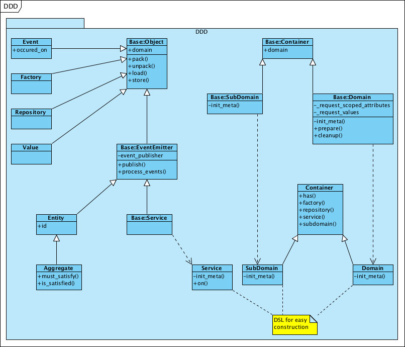

# DDD #

base classes for a simple Domain-Driven-Design Layer

Goals:

* have a simple DSL for constructing a Domain Layer

* allow accessing misc infrastructure layers

* simple PubSub mechanism for inter-process communication

* Catalyst integration

more: see pod.
